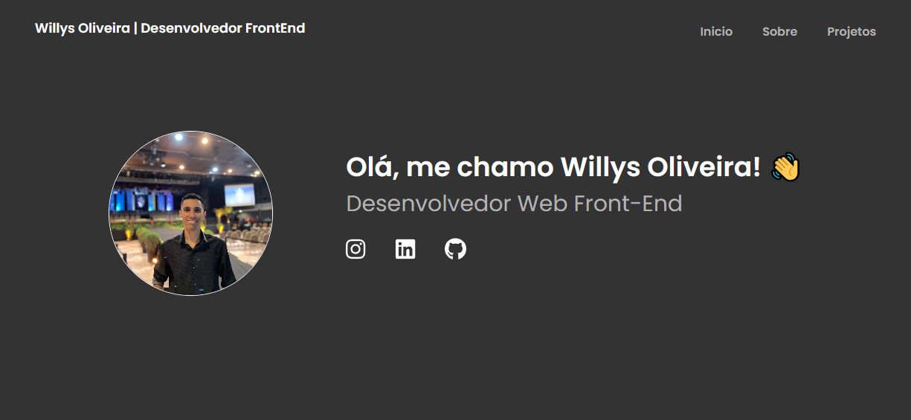

<h1 align="center"> Desafio Final VNW - Módulo 2 </h1>

  <a href="#-tecnologias">Tecnologias</a>&nbsp;&nbsp;&nbsp;|&nbsp;&nbsp;&nbsp;
  <a href="#-projeto">Projeto</a>&nbsp;&nbsp;&nbsp;|&nbsp;&nbsp;&nbsp;
  <a href="#-layout">Layout</a>&nbsp;&nbsp;&nbsp;|&nbsp;&nbsp;&nbsp;
  <a href="#memo-licença">Licença</a>

  

 

  

## 🚀 Tecnologias

Esse projeto foi desenvolvido com as seguintes tecnologias:

- HTML e CSS
- JavaScript
- React e Styled-Components
- Git e Github
- Figma

## 💻 Projeto

O Desafio Final VNW - Módulo 2 é uma web page que tem como objetivo colocar em prática os conhecimentos e conceitos sobre HTML, CSS, JavaScript, React e Design Responsivo aprendidos ao longo do módulo II do curso de Desenvolvimento Web do Vai Na Web.

- [Visite o projeto online](https://ollieveira.github.io/my-portfolio/)

## 🔖 Layout

Você pode visualizar o layout do projeto através [DESSE LINK](https://www.figma.com/file/AnC4p4LlU9K0D8tLmGY7uD/PORTIF%C3%93LIO-(Copy)?node-id=0%3A1&mode=dev).

## :memo: Licença

Esse projeto está sob a licença MIT.

---
